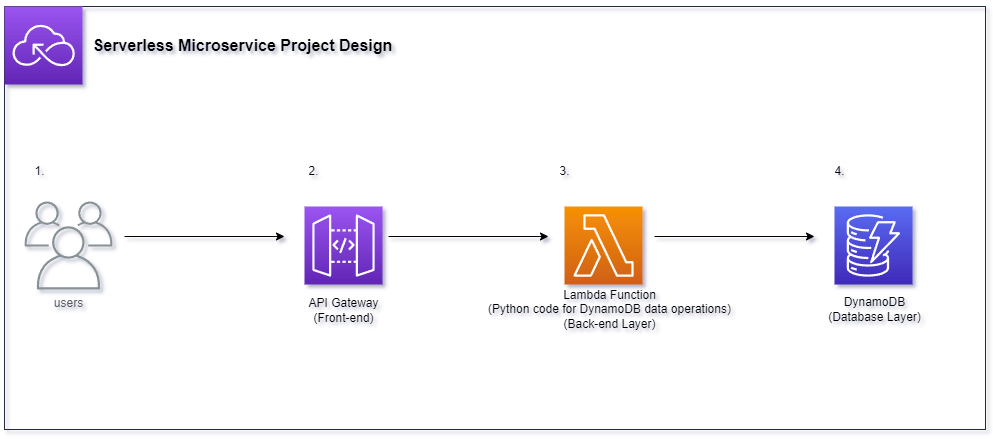

# Serverless Microservices Project

This project showcases a serverless microservices architecture using AWS. It employs API Gateway as the front-end interface, which communicates with a Lambda function serving as the back-end. This Lambda function performs create, read, update, and delete (CRUD) operations on DynamoDB tables. The entire setup demonstrates a practical, scalable, and cost-effective cloud solution.

## Architecture Overview

The architecture consists of four main components:

1. **Users**: Users interact with the system through a client application, which connects to the API Gateway to send requests and receive responses.

2. **API Gateway**: This acts as the front-end interface for the system. It handles incoming requests from users and routes them to the appropriate Lambda function.

3. **Lambda**: This is the back-end component. Upon receiving a request from API Gateway, the appropriate Lambda function is triggered to perform operations such as creating, updating, or deleting data.

4. **DynamoDB**: This is the database layer. It stores all the data and is interacted with via the Lambda functions.

## Key Features

- **CRUD Operations**: The system provides comprehensive CRUD (Create, Read, Update, Delete) functionality via the AWS API Gateway and Lambda. The API Gateway receives HTTP requests and triggers the appropriate Lambda function, which then interacts with the DynamoDB tables. This set-up enables efficient data management and promotes scalability.

- **Logging**: To enhance traceability and debugging, the system incorporates AWS CloudWatch logging. Each Lambda function execution is logged, providing valuable insights into the behavior of the system, aiding in identifying and rectifying any potential issues swiftly.

- **Security**: The project places a high priority on security. Access to DynamoDB tables and log creation is strictly controlled using AWS IAM roles and policies. Each Lambda function is assigned an IAM role with policies that limit its permissions to the minimum required. This practice, known as the principle of least privilege (PoLP), significantly reduces the potential impact of a security breach. 
