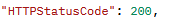

# Serverless Microservices Project

This project showcases a serverless microservices architecture using AWS. It employs API Gateway as the front-end interface, which communicates with a Lambda function serving as the back-end. This Lambda function performs create, read, update, and delete (CRUD) operations on DynamoDB tables. The entire setup demonstrates a practical, scalable, and cost-effective cloud solution.

## Disclaimer/Project Reference
This project is not mine nor is it my idea. This project was completed with the instructions from https://github.com/saha-rajdeep/serverless-lab. This project was done as a learning experience and I take no credit from the source. With that being said, I added my own explanations to why each section and technology were used and how they all fit together to showcase what I've learned.

## Architecture Overview


The architecture consists of four main components:

1. **Users**: Users interact with the system through a client application, which connects to the API Gateway to send requests and receive responses.

2. **API Gateway**: This acts as the front-end interface for the system. It handles incoming requests from users and routes them to the appropriate Lambda function.

3. **Lambda**: This is the back-end component. Upon receiving a request from API Gateway, the appropriate Lambda function is triggered to perform operations such as creating, updating, or deleting data.

4. **DynamoDB**: This is the database layer. It stores all the data and is interacted with via the Lambda functions.

## Key Features

- **CRUD Operations**: The system provides comprehensive CRUD (Create, Read, Update, Delete) functionality via the AWS API Gateway and Lambda. The API Gateway receives HTTP requests and triggers the appropriate Lambda function, which then interacts with the DynamoDB tables. This set-up enables efficient data management and promotes scalability.

- **Logging**: To enhance traceability and debugging, the system incorporates AWS CloudWatch logging. Each Lambda function execution is logged, providing valuable insights into the behavior of the system, aiding in identifying and rectifying any potential issues swiftly.

- **Security**: The project places a high priority on security. Access to DynamoDB tables and log creation is strictly controlled using AWS IAM roles and policies. Each Lambda function is assigned an IAM role with policies that limit its permissions to the minimum required. This practice, known as the principle of least privilege (PoLP), significantly reduces the potential impact of a security breach. 

# Project Setup/How I Completed This Project
 This project was established and configured manually utilizing the AWS Management Console. Here's a step-by-step outline of the setup process:
## 1. Create an IAM Role linked to Lambda
  - The first step was to set up an IAM role that would be used by the Lambda function. This role is important for granting the necessary permissions to the Lambda function so it can interact with other AWS services on behalf of the user.
  
  - I created an IAM role named lambda-apigateway-role specifically for this project. This role has a custom policy attached to it, which grants it permissions to perform various operations such as writing data to DynamoDB and uploading logs to CloudWatch.
  
  - Here's a snapshot of the policy:
 

- This IAM Policy is a two part-policy. It grants permissions for DynamoDB in the first half and CloudWatch Logs operations. The first part grants full access to DynamoDB operations using the lines: DeleteItem, GetItem, PutItem, Query, Scan, and UpdateItem for all resources, denoted by the "*".
- The second half grants permissions to CreateLogGroup, CreateLogStream, and PutLogEvents for CloudWatch logs on all resources. This half of the json code enables creation and updating of log groups and streams, as well as the posting of log events to CloudWatch.

**Explanation**: By creating this IAM role, I followed the principle of least privilege (PoLP), which states that a user should be given the minimum levels of access necessary to complete his/her tasks. This minimizes potential damage in case of an error or security breach. In the context of this project, by strictly controlling the permissions granted to the lambda-apigateway-role, I aimed to minimize potential security risks while ensuring the role has the necessary access to perform its tasks. It can manipulate data in DynamoDB and create logs in CloudWatch, but it doesn't have unnecessary permissions that could be exploited in case of a security breach.

## 2. Create the Lambda Function
The next step in the setup process was to create the AWS Lambda function that would serve as the backend for the microservice.
 - I authored a Python function from scratch. The AWS SDK for Python (Boto3) provides an easy-to-use, high-level interface for interacting with AWS services.
 - I attached the previously created IAM role, **lambda-apigateway-role**, to this function. This role provides the function with the necessary permissions to interact with DynamoDB for data operations and with CloudWatch for logging.
 - The function is designed to be triggered by API Gateway later on in the project. It processes incoming requests, performs the appropriate operation (Create, Read, Update, Delete) on the DynamoDB table based on the request from the User, and returns a response.
 - Below is the python/boto3 code used for the project:
```python
import boto3
import json

print('Loading function')


def lambda_handler(event, context):
    '''Provide an event that contains the following keys:

      - operation: one of the operations in the operations dict below
      - tableName: required for operations that interact with DynamoDB
      - payload: a parameter to pass to the operation being performed
    '''
    #print("Received event: " + json.dumps(event, indent=2))

    operation = event['operation']

    if 'tableName' in event:
        dynamo = boto3.resource('dynamodb').Table(event['tableName'])

    operations = {
        'create': lambda x: dynamo.put_item(**x),
        'read': lambda x: dynamo.get_item(**x),
        'update': lambda x: dynamo.update_item(**x),
        'delete': lambda x: dynamo.delete_item(**x),
        'list': lambda x: dynamo.scan(**x),
        'echo': lambda x: x,
        'ping': lambda x: 'pong'
    }

    if operation in operations:
        return operations[operation](event.get('payload'))
    else:
        raise ValueError('Unrecognized operation "{}"'.format(operation))
```
 
**Explanation**: This Python Script defines a Lambda function handler that responds to different operations on a DynamoDB table. We import boto3 and json libraries to start the code off. The main function: lamda_handler, will be the function that will be triggered when the code is executed. The operation = event line will extract the DynamoDB operation to be performed from the event.
 - The if 'tableName' in event code block will create a DynamoDB table resource if the event contains a tableName. This is done with the imported boto3 library, with dynamo being a boto3 resource linked to DynamoDB. Important resources from AWS can be found on the boto3 documentation website.
 - The dictionary, operations, will define each specific DynamoDB operation. Each line speaks for itself in DynamoDB action terms. Create puts a new piece of data in the table, read gets the item, and so on.
 - Lastly, the final if-else block makes sure that if the operation specified in the vent is tin the operations dictionary, it will execute the code. If the operation is not in the operations dictionary however, it will raise an error.

## 3. Test the Code
I used a simple test code provided by the guide to test the functionality of the Lambda code before deploying it.
- Below is a snapshot of the test code used:


- Here is the result of the provided test:


**Explanation**: This JSON code is a test event for the Lambda function. It specifies an operation "echo" and provides data for the function to work with. The payload contains two key-value pairs: "somekey1" with value "somevalue1", and "somekey2" with the value "somevalue2". The echo test succeeded in returning the key-value pairs to me, meaning it is ready to be deployed.

## 4. Create a DynamoDB Table
I then created a new DynamoDB table with a table name of lambda-apigateway and a primary key of id(string)


**Explanation**: This is a relatively simple process. DynamoDB provides a scalable, low-latency, and highly available NoSQL data storage. The DynamoDB table will act as a database layer for our architecture and allow us to store data from API Gateway to Lambda function calls. 

## 5. Create an API through API Gateway
Next, I created a new REST API named DynamoDBOperations. This API acts a central interface for external users to interact with our AWS services, in this case, our DynamoDB table and Lambda function. It is essentially the a "front door" for applications and users to access data and backend services.
- Below is a snapshot of the created resource, DynamoDBManager:


- Then,  I created a new POST method for the DynamoDBManager resource. This is done by selecting the Actions dropdown menu, and choosing 'Create Method' while the /dynamodbmanager resource is selected. The POST method is commonly used to send data to the server to create a new record.
- This new POST method is set up to trigger a Lambda function. In the setup shown in the screenshot below, 'Lambda Function' is selected as the integration type, and 'LambdaFunctionOverHttps' is specified as the function to be triggered. This is the name of the Lambda function we created earlier in the project.


- Finally, I selected Deploy API in a new Deployment stage, I named the stage Prod, for production purposes in a hypothetical work scenario. 
- With this, the architecture is all set up to run the solution. I have the Invoke URL from my Post Method hidden for privacy purposes.

**Explanation**: With this setup, when a POST request is made to the /dynamodbmanager endpoint of our API, it will trigger the 'LambdaFunctionOverHttps' function. This function is designed to execute complex business logic and interact with our DynamoDB table. This setup is highly flexible and can be adapted to handle a wide range of applications and workflows, which is why I chose to undertake this project and gain experience for Microservices and API's, which I believe are invaluable skills for cloud.

## 6. Run Solution
This is the final step. I used a third-party website called POSTman to test out my new API project.  Postman allows you to send requests to an API and view the responses, making it an excellent tool for testing and debugging.
- I used Postman to send a POST request to the /dynamodbmanager endpoint of my API, passing in the JSON payload below. I then checked the response to ensure that the LambdaFunctionOverHttps function was triggered correctly and that the data was successfully stored in the DynamoDB table.


- Below is a small image of the successful POST with a 200 code:



- Below is an image of the DynamoDB table with the piece of data successfully collected.


- Finally, I used Postman to test a 'list' operation, which is designed to retrieve all items from the DynamoDB table. This showcases that the first operation with Postman was a success.


**Explanation and Final Thoughts**: In this project, I created a serverless architecture to handle data operations through a REST API. This architecture used a DynamoDB table for data storage, a Lambda Function for executing business logic, and an API Gateway to allow users to interact with the project. I used Postman to test the API, confirming that data could be successfully stored and retrieved from the DynamoDB table via the API. Overall, this project proved me with valuable hands-on experience with microservices, API's and how they interact within AWS overall. 

## Cleanup
This was an easy cleanup, simply selecting delete on all three of the services removes the architecture.
